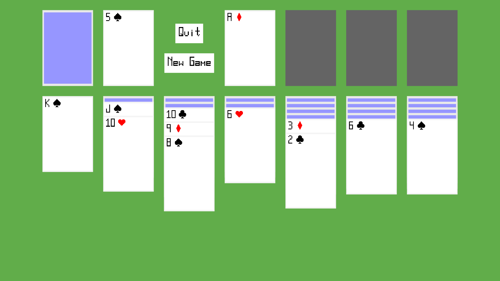

Solitaire
=========

- Klondike solitaire.
- Single card turn. No limit on passes through deck.
- Completely drawn on canvas element.

[Play online](https://costava.github.io/solitaire/dist/)

Development
-----------

1. Fork the repo
2. Create a branch off of the `dev` branch
3. `npm install`
4. `npm run build-dev`
5. Open `dist/index.html` in a browser to run

Open a pull request into the `dev` branch.
Changes on `dev` will be merged to `master` when a release is made.
